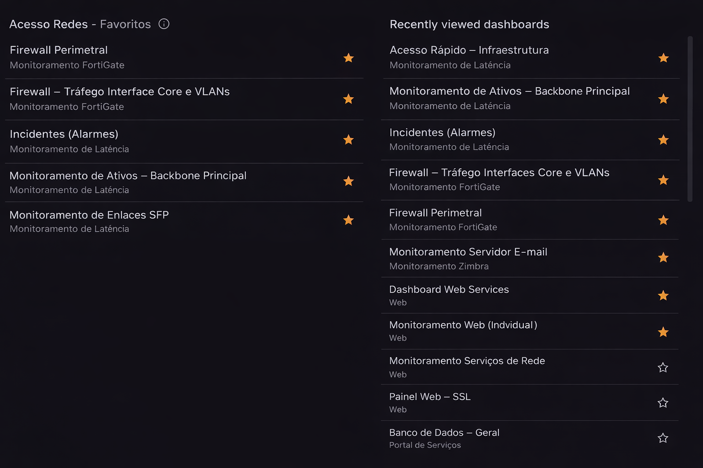
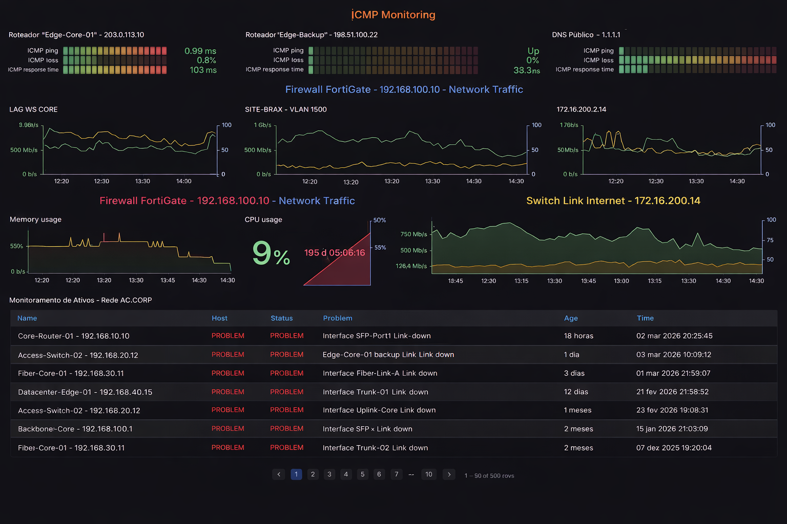
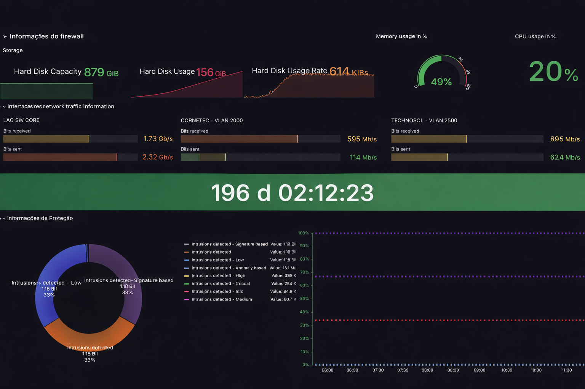
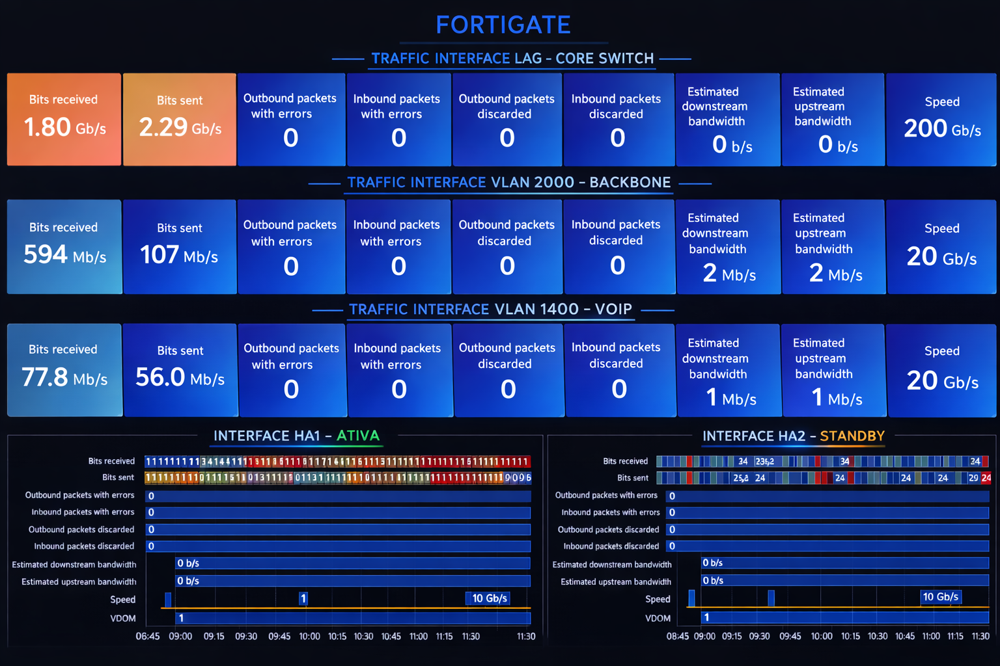
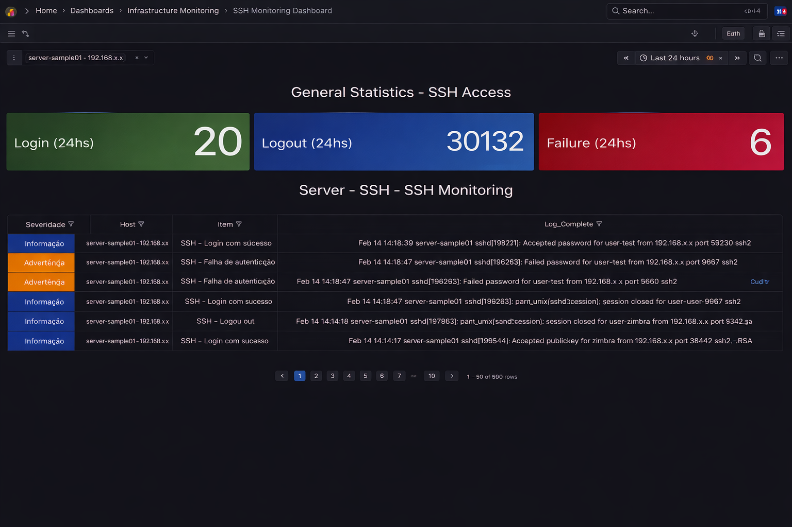

# 📊 Grafana Monitoring Dashboards
Enterprise Observability Dashboards for Network, Security and Infrastructure Monitoring


---

## 🇧🇷 Sobre o Projeto

Este repositório contém dashboards corporativos desenvolvidos para **monitoramento de infraestrutura**, com foco em:

- Acesso Rápido
- Monitoramento de Latência (NOC)
- Monitoramento de Firewall FortiGate
- Monitoramento de Servidor de E-mail Zimbra (SSH Security)

Os dashboards foram projetados com foco em:

- Observabilidade
- Segurança
- Performance de rede
- Visão operacional para NOC
- Monitoramento em tempo real

---

## 🇺🇸 About the Project

This repository contains enterprise-level Grafana dashboards designed for:

- Quick Access
- Network Latency Monitoring
- FortiGate Firewall Monitoring
- Zimbra Mail Server SSH Security Monitoring

These dashboards focus on:

- Infrastructure observability
- Network performance
- Security monitoring
- NOC visibility
- Real-time analysis

---

## 📂 Repository Structure

```
.
├── dashboards/
│   ├── 01-acesso-rapido.json
│   ├── 02-latencia-monitoring-noc.json
│   ├── 03-fortigate-recursos.json
│   ├── 04-fortigate-ha1-ha2.json
│   └── 05-zimbra-ssh-monitoring.json
│
├── images/
│   ├── acesso-rapido-preview.png
│   ├── latencia-monitoring-noc-preview.png
│   ├── fortigate-preview.png
│   ├── fortigate-ha1-ha2-preview.png
│   └── zimbra-ssh-monitoring-preview.png
│
└── README.md
```


# 📊 Dashboards Overview

### 1️⃣ Dashboard de Acesso rápido 
 
📁 File: `01-acesso-rapido.json`

- Facilita vizualização favoritos e acesso recentes.

### 🖼 Preview




### 2️⃣ Latency Monitoring Dashboard (NOC)

📁 File: `02-monitoramento-latencia-NOC.json`


### 🔎 Features

- ICMP Ping Monitoring
- ICMP Packet Loss
- ICMP Response Time
- Redundant Fiber Link Monitoring
- Google DNS Monitoring
- FortiGate Interface Traffic (LAG, WAN Primary, WAN Backup)
- Internet Link Throughput
- Network Asset Status Overview (Host, Status, Problem, Age, Time)

### 🖼 Preview




### 3️⃣ FortiGate Monitoring Dashboard

📁 File: `03-monitoramento-fortigate-IPS.json` 
       `04-monitoramento-fortigate-ha1-ha2..json`

### 🔎 Features

- Disk Capacity Monitoring
- Disk Usage Rate
- CPU Utilization
- Memory Usage
- Interface Traffic Monitoring:
  - LAG SW CORE
  - WAN Primary
  - WAN Redundant
  - VLAN GENERIC
  - VLAN GENERIC
  - HA1 / HA2
- FortiGate Uptime
- IPS Information

### 🖼 Preview





### 4️⃣ Dashboard Zimbra SSH Security Monitoring

📁 File: `05-monitoramento-zimbra-ssh.json`

### 🔎 Features

- SSH Login Statistics (24h)
- SSH Logout Statistics (24h)
- Authentication Failures (24h)
- Detailed Log Monitoring:
  - Severity
  - Host
  - Item
  - Full SSH Log
  - Access IP
  - Timestamp
  - User

### 🖼 Preview



---

# ⚙️ Installation & Configuration


## 🔴 Zabbix Data Source Configuration (Required for Dashboards 2,3 & 4)

### Step 1 – Install Zabbix Plugin

1. Go to: Configuration → Plugins
2. Search for: Zabbix
3. Install: alexanderzobnin-zabbix-app


### Step 2 – Add Zabbix Data Source

1. Go to: Connections → Data Sources
2. Click: Add data source
3. Select: Zabbix
4. Configure:
- Zabbix API URL
- Username
- Password
5. Click: Save & Test

---

## 🔵 MySQL Data Source Configuration (Required for Dashboard 5)

### Step 1 – Add MySQL Data Source

1. Go to: Connections → Data Sources
2. Click: Add data source
3. Select: 
---

### Step 2 – Configure Database Access

Configure:

- Host
- Port (default 3306)
- Database: `zabbix`
- User
- Password

---

### Step 3 – Save & Test

Ensure status: Database Connection OK

---

# 📥 Importing Dashboards

1. Go to: Dashboards → Import
2. Upload the corresponding `.json` file
3. Select the correct data source
4. Click:Import

---

# 🔐 Security Notice

All dashboards were exported using Grafana external export mode to ensure:

- No production IP exposure
- No sensitive hostnames
- No credential leakage
- No environment-specific identifiers

---

# 🚀 Project Goals

- Provide reusable enterprise monitoring dashboards
- Deliver production-ready observability solutions
- Support NOC operations
- Improve infrastructure visibility

---

# 📄 License

MIT License

Copyright (c) 2026 Jardane Lima Maciel

Permission is hereby granted, free of charge, to any person obtaining a copy
of this software and associated documentation files (the "Software"), to deal
in the Software without restriction, including without limitation the rights
to use, copy, modify, merge, publish, distribute, sublicense, and/or sell
copies of the Software, and to permit persons to whom the Software is
furnished to do so, subject to the following conditions:

The above copyright notice and this permission notice shall be included in all
copies or substantial portions of the Software.

THE SOFTWARE IS PROVIDED "AS IS", WITHOUT WARRANTY OF ANY KIND, EXPRESS OR
IMPLIED, INCLUDING BUT NOT LIMITED TO THE WARRANTIES OF MERCHANTABILITY,
FITNESS FOR A PARTICULAR PURPOSE AND NONINFRINGEMENT. IN NO EVENT SHALL THE
AUTHORS OR COPYRIGHT HOLDERS BE LIABLE FOR ANY CLAIM, DAMAGES OR OTHER
LIABILITY, WHETHER IN AN ACTION OF CONTRACT, TORT OR OTHERWISE, ARISING FROM,
OUT OF OR IN CONNECTION WITH THE SOFTWARE OR THE USE OR OTHER DEALINGS IN THE
SOFTWARE.


 
---


